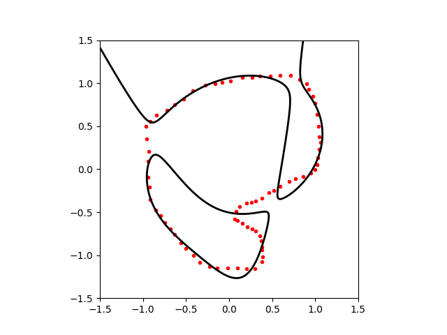
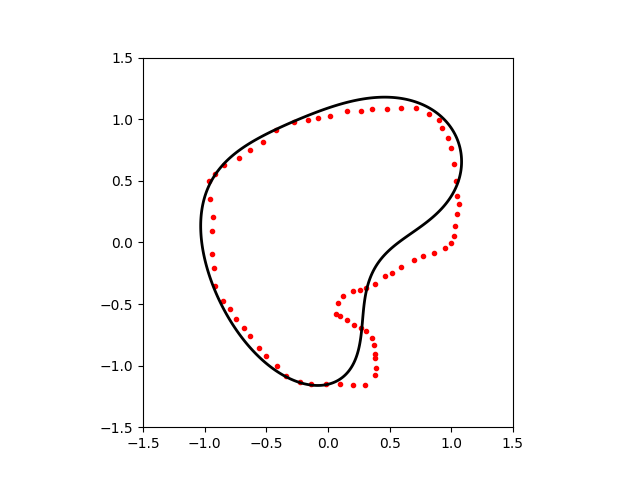
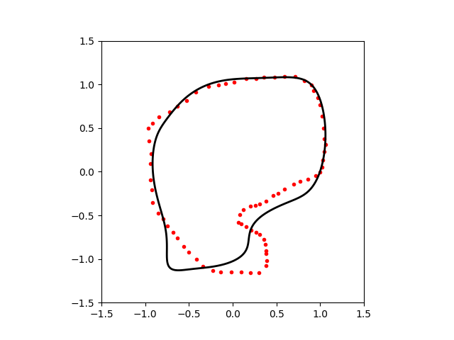

# Imlcit Curve Approximation

## Environments
 * Python 3.6.2
 * libraries are listed in pip.freeze

## How To Run
```bash
python main.py configfile.txt
```

## Config File
Example for gradient-one method.
Please refer to "config" directory for other methods and more details.

```text
model=tasdizen2000
dataset=dataset/shape1
degree=4
mu=1.0
```

## Methods
### Classic Least Square
 * G. Taubin, 1991 (Estimation of Planar Curves, Surfaces, and Nonplanar Space Curves Defined by Implicit
    Equations with Applications to Edge and Range Image Segmentation)
 * "model=taubin1991"

```bash
python main.py config/taubin1991_shape1.txt
```



### Gradient-One Method
 * T. Tasdizen, et al., 2000 (Improving the Stability of Algebraic Curves for Applications)
 * "model=tasdizen2000"
 * The data points should be ordered in this implementation
    (there are alternative way to calculate local gradient if the data points are not ordered)
 
 ```bash
python main.py config/tasdizen2000_shape1.txt
```



### Topologically Faithful Fitting
 * D. Keren, et al., 2004 (Topologically Faithful Fitting of Simple Closed Curves)
 * "model=keren2004"
 * In this code, Naive Nelder-Mead method (from scipy) is used
 * The estimation for the following result does not use 3L algorithm.
    3L algorithm is implemented in our code,
    but it does not improve fitting very much in my implementation.
 
 ```bash
python main.py config/keren2004_shape1.txt
```




## Author
Ryo Kamoi ([https://ryokamoi.github.io/](https://ryokamoi.github.io/))
